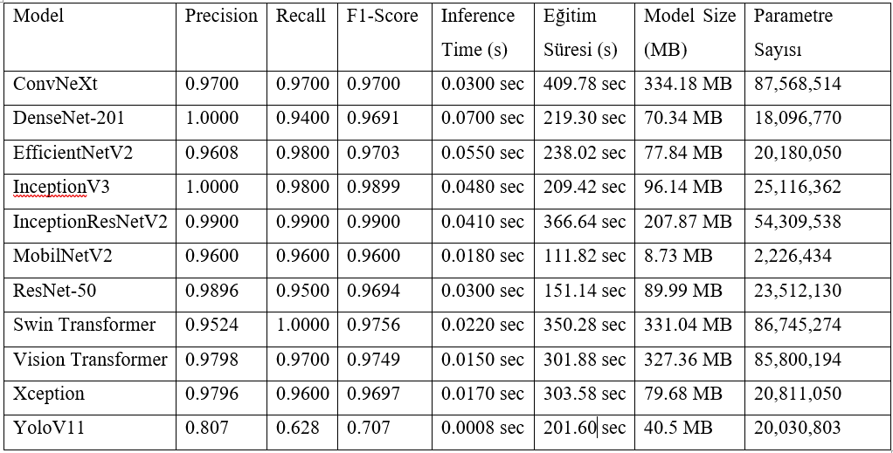

ResNet-50, DenseNet-201, Inception-V3, InceptionResNet-V2, Xception, MobileNet, EfficientNet-V2S ve YoloV11 modelleri üzerinde 10 epoch eğitimden geçirildi.
Eğitimlerin hepsi 4070 ti süper ekran kartı ile yapılmıştır.

